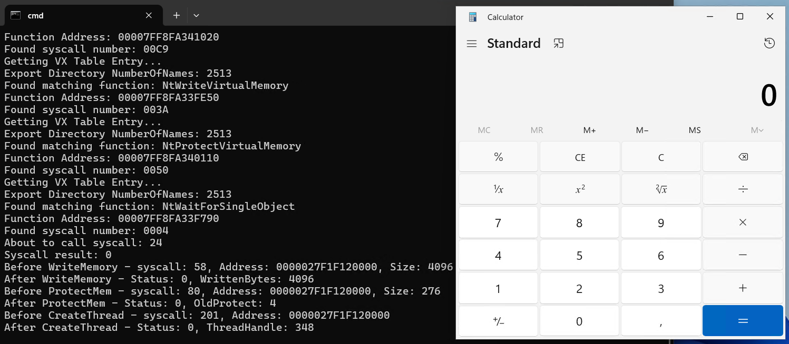

# Tartarus' Gate - Bypassing EDRs

This repository is the Delphi implementation of Tartarus' Gate based on https://github.com/trickster0/TartarusGate.

Tartarus - Windows System Call Invocation Project
Based on Hell's Gate technique

This program demonstrates direct system call invocation by:
1. Getting system call numbers from NTDLL
2. Using custom assembly to make direct system calls
3. Bypassing standard API calls

  

# Contributing

Contributions are welcome! If you have suggestions or bug fixes, please fork the repository and submit a pull request.

Made with ❤️ using Delphi RAD Studio

